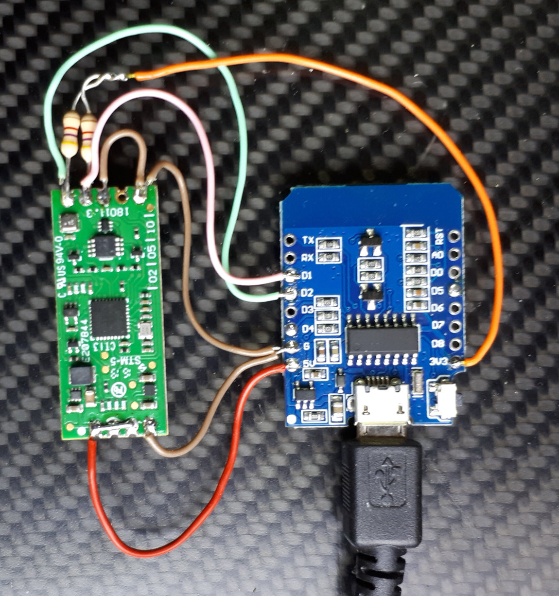

# EE895
An Arduino library for the [EE895 CO2 sensor](https://www.epluse.com/en/products/co2-measurement/co2-sensor/ee895/) manufactured by E+E Elektronik Ges.m.b.H.

## Hardware setup

### D1 Mini

on WeMos D1 Mini
* EE895 is supplied with 5V
* SDA on GPIO 4 / D2, 4k7 Pullup to 3.3V
* SCL on GPIO 5 / D1, 4k7 Pullup to 3.3V
